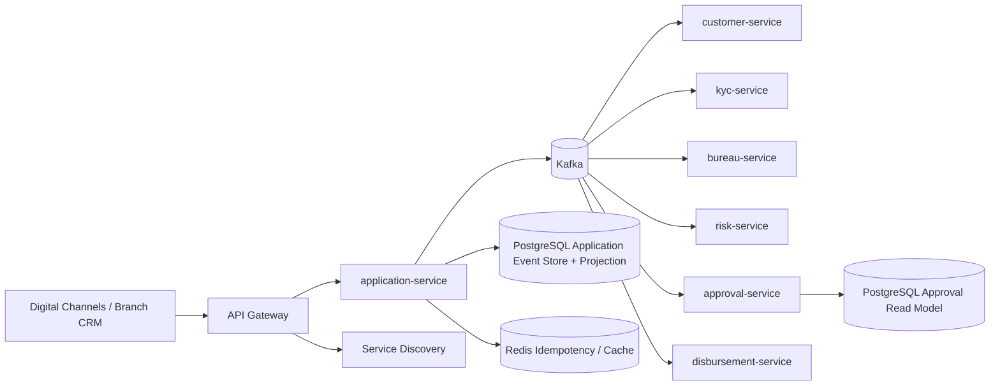

# Distributed Loan Origination Architecture

## Executive View

This repository models a retail banking loan origination platform with autonomous bounded contexts, asynchronous underwriting, event-sourced auditability, and CQRS read models.

## Bounded Contexts

| Service | Responsibility | Owns Data | Publishes |
|---|---|---|---|
| application-service | Accepts loan applications, starts saga, stores application events and projection | Application aggregate, event store | `ApplicationSubmitted` |
| customer-service | Customer master validation and relationship checks | Customer verification decision | `CustomerVerified`, `LoanRejected` |
| kyc-service | AML, sanctions, PEP, risk banding | KYC decision | `KycCompleted`, `LoanRejected` |
| bureau-service | External bureau integration abstraction | Bureau pull result | `BureauCheckCompleted`, `LoanRejected` |
| risk-service | Risk scoring and policy decisioning | Risk assessment | `RiskAssessed`, `LoanRejected` |
| approval-service | Credit approval and authority assignment | Approval read model | `LoanApproved` |
| disbursement-service | Core banking payout orchestration | Disbursement instruction | `LoanDisbursed` |

## Architecture Patterns

- Microservices: independently deployable bounded contexts.
- Event Driven Architecture: Kafka is the durable integration backbone.
- Saga Pattern: choreography-based saga progresses application state through domain events.
- Event Sourcing: application-service persists immutable application events before publishing.
- CQRS: command API writes application state; approval-service exposes an approval read model.
- DDD: domain events represent business facts, not technical integration messages.
- API Gateway: single ingress for digital channels.
- Service Discovery: Eureka supports service lookup in local and container deployments.
- Observability: actuator, Prometheus metrics, and OpenTelemetry OTLP export.

## Production Hardening Extensions

- Add transactional outbox for exactly-once event handoff from PostgreSQL to Kafka.
- Use schema registry with Avro/Protobuf for backward-compatible contracts.
- Add idempotency keys and Redis-backed duplicate suppression for public commands.
- Split PostgreSQL databases per service in managed production environments.
- Enforce mTLS, OAuth2/OIDC, and field-level encryption for PII.
- Add compensation events for failed disbursement and manual underwriting queues.
