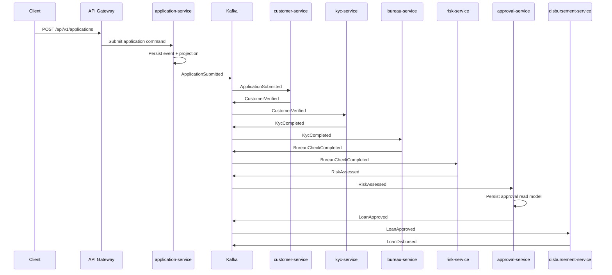
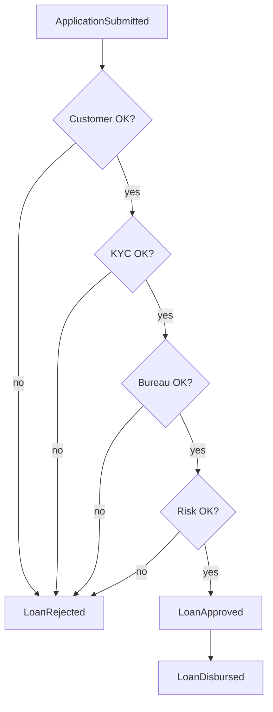

# Loan Origination Event Flow

## Happy Path

```mermaid
sequenceDiagram
  participant C as Client
  participant G as API Gateway
  participant A as application-service
  participant K as Kafka
  participant CS as customer-service
  participant KY as kyc-service
  participant B as bureau-service
  participant R as risk-service
  participant AP as approval-service
  participant D as disbursement-service

  C->>G: POST /api/v1/applications
  G->>A: Submit application command
  A->>A: Persist event + projection
  A->>K: ApplicationSubmitted
  K->>CS: ApplicationSubmitted
  CS->>K: CustomerVerified
  K->>KY: CustomerVerified
  KY->>K: KycCompleted
  K->>B: KycCompleted
  B->>K: BureauCheckCompleted
  K->>R: BureauCheckCompleted
  R->>K: RiskAssessed
  K->>AP: RiskAssessed
  AP->>AP: Persist approval read model
  AP->>K: LoanApproved
  K->>D: LoanApproved
  D->>K: LoanDisbursed
```

## Rejection Path

Any policy service can terminate the saga by publishing `LoanRejected`.

```mermaid
flowchart TD
  A[ApplicationSubmitted] --> C{Customer OK?}
  C -- no --> X[LoanRejected]
  C -- yes --> K{KYC OK?}
  K -- no --> X
  K -- yes --> B{Bureau OK?}
  B -- no --> X
  B -- yes --> R{Risk OK?}
  R -- no --> X
  R -- yes --> P[LoanApproved]
  P --> D[LoanDisbursed]
```
